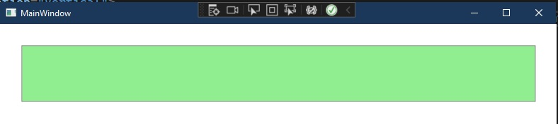

# Mc:Ignorable attribute.

## Objective
1. Introduces mc:Ignorable attribute.

## References
1. https://learn.microsoft.com/en-us/dotnet/desktop/wpf/advanced/mc-ignorable-attribute
2. https://learn.microsoft.com/en-us/visualstudio/xaml-tools/xaml-designtime-data
3. https://stackoverflow.com/q/15749584/1977871

## How this project is built.
1. This is a regular NET 7 windows project.
2. Add the following headers
```xaml
xmlns:d="http://schemas.microsoft.com/expression/blend/2008"
xmlns:mc="http://schemas.openxmlformats.org/markup-compatibility/2006"
mc:Ignorable="d"
``` 
3. After adding the namespaces, you can put d: in front of any attribute or control to show it only in the XAML Designer but not at runtime. In the example, we have added d to the Content of the first button

```xaml
<Button x:Name="firstButton" d:Content="Click me" Click="firstButton_Click" Background="LightGreen" Height="80" Margin="30" />
```

4. Now, with this d attribute applied, the button will look as follows in the designer, with the content.


## Notes

1. When you run it, there will not be any content in the first button. And there is no second button at all.



2. This button has a click event, and when you click, the content is set adn the window looks as follows.


3. Note the entire second button is not visible at all. This is because the d attribute is applied to the button itself.

