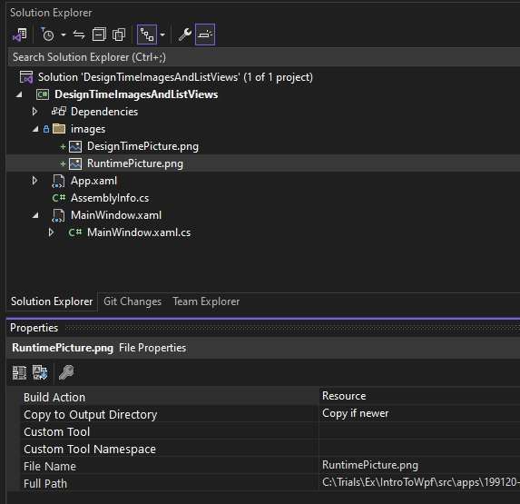

# Mc:Ignorable attribute.

## Objective
1. Introduces mc:Ignorable attribute.

## References
1. https://learn.microsoft.com/en-us/dotnet/desktop/wpf/advanced/mc-ignorable-attribute
2. https://learn.microsoft.com/en-us/visualstudio/xaml-tools/xaml-designtime-data
3. https://stackoverflow.com/q/15749584/1977871

## How this project is built.
1. This is a regular NET 7 windows project.

2. Refer to the following.
   1. https://learn.microsoft.com/en-us/visualstudio/xaml-tools/xaml-designtime-data#design-time-data-basics
   2. https://learn.microsoft.com/en-us/visualstudio/xaml-tools/xaml-designtime-data#preview-images-at-design-time

3. The image element would look like the following

```xaml
<Image x:Name="ImageEx" d:Source="images\DesignTimePicture.png" Height="300" Width="500" />
```

## Notes

1. Open Visual studio, there will be a design time pic shown. When you run it, a run time pic will be shown.




