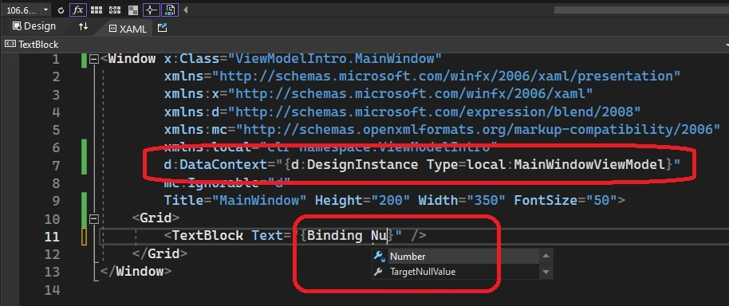

# Introduces View Model.

1. Start from the basic wpf application.

2. Add a new MainWindowViewModel class with a string property called Number.

3. In the code behing MainWindow.xaml.cs file, assign the above object MainWindowViewModel as DataContext to MainWindow.

4. In the MainWindw.xaml file, add the following. This will enable intellisence at design time.

```xaml
d:DataContext="{d:DesignInstance Type=local:MainWindowViewModel}"
```



5. Finally add the following Textblock to the MAinWindow.

```xaml
<TextBlock Text="{Binding Number}" />
```


