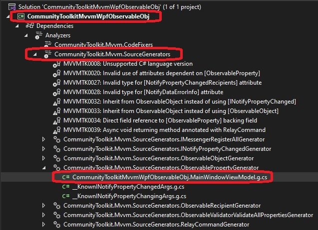

# Introduces Community Tool kit.

## References.
1. https://learn.microsoft.com/en-us/dotnet/communitytoolkit/mvvm/

2. https://github.com/CommunityToolkit

3. https://www.youtube.com/watch?v=uVIzK2snugk

## How this app is built.
1. Start from the earlier example, 200400-CommunityToolkitMvvmWpfIntro

2. The MainWindowViewModel, instead of implimenting INotifyPropertyChanged, will derive from ObservableObject

3. Observe the following

```cs
[ObservableProperty]
[NotifyCanExecuteChangedFor(nameof(ClickCommand))]
private string _firstName = "Vivek";
```

The attribute ObservableProperty will make the field to a full fledged property FirstName using code generation.
Also hover over NotifyCanExecuteChangedFor attribute, and you will see the expaination what it will do.


4. Finally note the attribute on the mehtod Onclick()

```cs
[RelayCommand(CanExecute = nameof(CanClick))]
private void OnClick()
{
    FirstName = "Koppula";
}
```

This will result in a relay command with the OnClick and CanClick as delegates. Everyting autogenerated. So the following entirely will become unnecessary. This will take care of by the code generated. 

```cs
public IRelayCommand ClickCommand { get; }

public MainWindowViewModel()
{
    ClickCommand = new RelayCommand(OnClick, CanClick);
}
```

5. To see the code generated, 



6.Note the generated code looks something like the followng.
```cs
partial class MainWindowViewModel
{
    /// <inheritdoc cref="_firstName"/>
    [global::System.CodeDom.Compiler.GeneratedCode("CommunityToolkit.Mvvm.SourceGenerators.ObservablePropertyGenerator", "8.2.0.0")]
    [global::System.Diagnostics.CodeAnalysis.ExcludeFromCodeCoverage]
    public string FirstName
    {
        get => _firstName;
        [global::System.Diagnostics.CodeAnalysis.MemberNotNull("_firstName")]
        set
        {
            if (!global::System.Collections.Generic.EqualityComparer<string>.Default.Equals(_firstName, value))
            {
                OnFirstNameChanging(value);
                OnFirstNameChanging(default, value);
                OnPropertyChanging(global::CommunityToolkit.Mvvm.ComponentModel.__Internals.__KnownINotifyPropertyChangingArgs.FirstName);
                _firstName = value;
                OnFirstNameChanged(value);
                OnFirstNameChanged(default, value);
                OnPropertyChanged(global::CommunityToolkit.Mvvm.ComponentModel.__Internals.__KnownINotifyPropertyChangedArgs.FirstName);
                ClickCommand.NotifyCanExecuteChanged();
            }
        }
    }
}
```

Observe what all this generates. Like OnFirstNameChanging and OnFirstNameChanged. You can use these methods. These are like extension points.